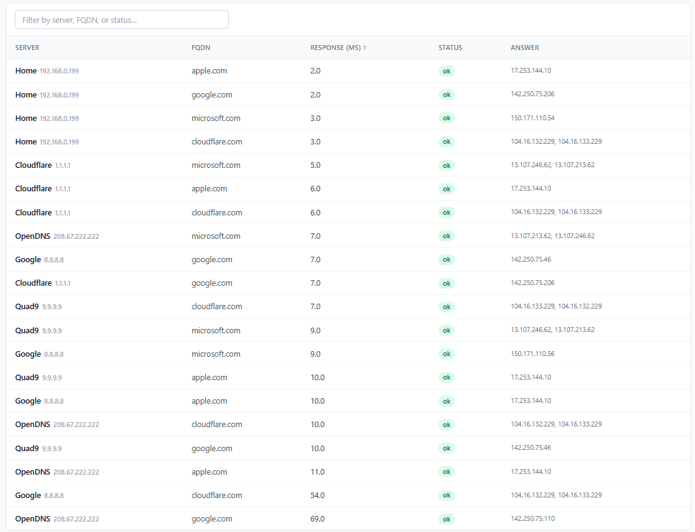
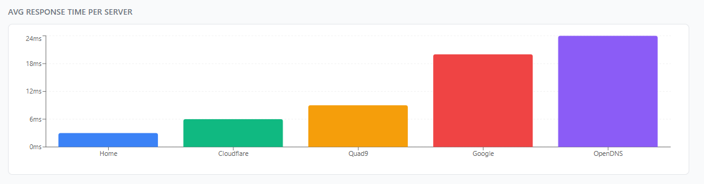
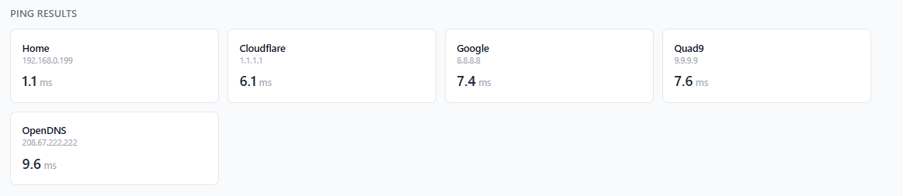
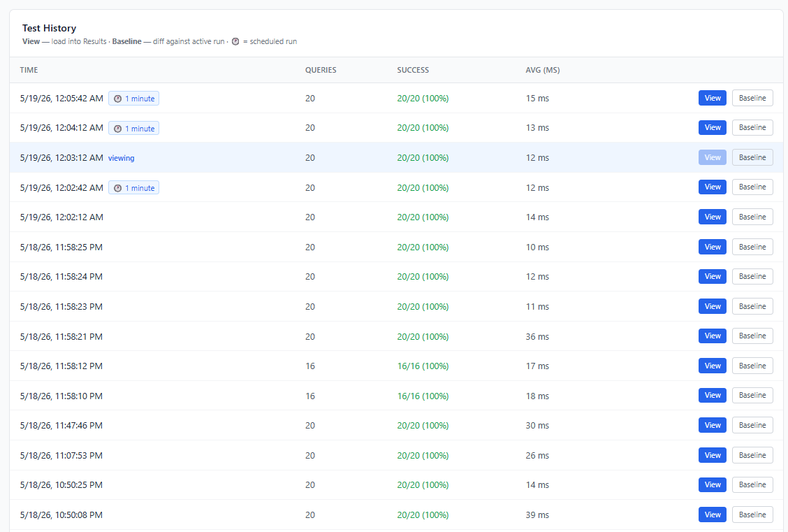
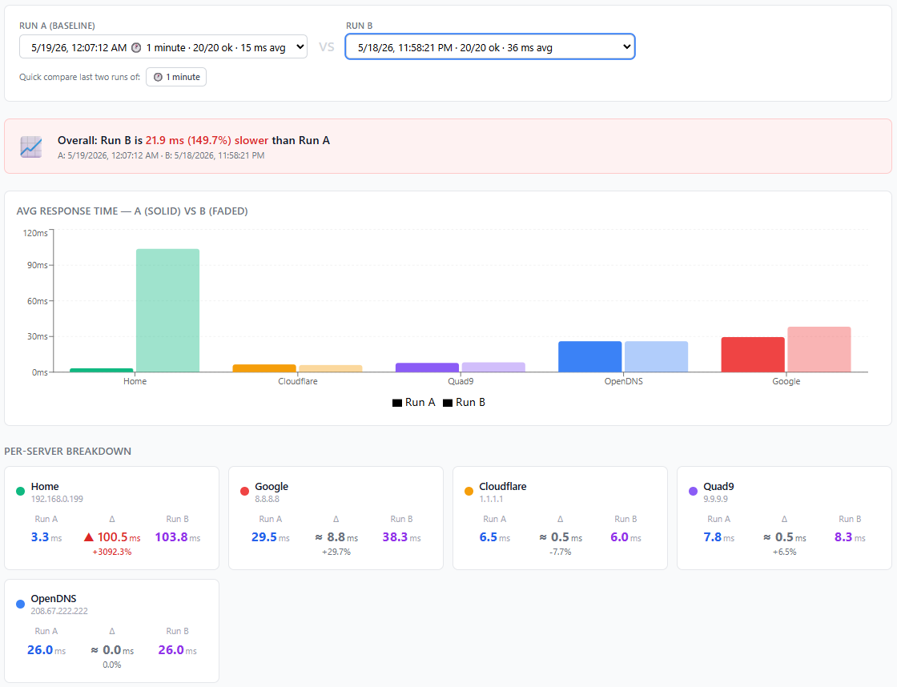
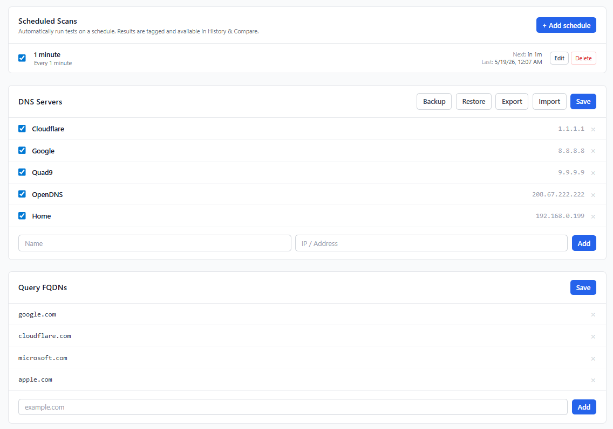

# go-dnstester

A single Go binary that benchmarks DNS servers — plain UDP/53, DNS over TLS (DoT), and DNS over HTTPS (DoH) — by querying a configurable list of FQDNs, recording response times, pinging each server, and presenting the results in a modern web UI.

## Features

### Results Table
Query results in a sortable, filterable table: server name, protocol badge (DoT/DoH), FQDN, response time (ms), status, and resolved answers.



### Response Time Graph
Bar chart of average response time per server for the current run, with optional baseline overlay when comparing runs.



### Ping Results
ICMP (or TCP fallback) latency to each configured server. DoH servers ping the upstream hostname on port 443; DoT servers use port 853.



### Test History
Full log of every test run with timestamp, query count, success rate, and average response time. Paginated with a configurable page size (10 / 25 / 50 / 100). Load any past run into the results view or set it as a baseline.



### Run Comparison
Select any two historical runs and see an overall delta, side-by-side bar chart, and a per-server breakdown with ms and percentage change.



### DNS Protocol Support
Test plain **UDP/53**, **DNS over TLS (DoT / port 853)**, and **DNS over HTTPS (DoH / RFC 8484)** side-by-side. Protocol is selectable per server when adding entries. Results carry a coloured badge (blue = DoT, green = DoH) throughout the UI.

Pre-configured but disabled examples included:

| Protocol | Servers |
|----------|---------|
| DoT | Cloudflare · Google · Quad9 |
| DoH | Cloudflare · Google · Quad9 · AdGuard |

### Scheduled Scans
Automatic runs on a flexible schedule: every N minutes/hours, daily, specific weekdays, weekly, monthly, or once. Results are tagged and available in History and Compare.

### Settings
Manage DNS servers (with protocol), FQDNs, and scheduled scans. Backup, restore, export, and import configuration.



### Dark Mode
Light/dark theme toggle (☀️ / 🌙) in Settings → General. Preference is saved to `localStorage` and respects the system `prefers-color-scheme` on first visit. Applied before first render — no flash.

### Mobile-First UI
Fully responsive layout that works on phones without horizontal scroll. The DNS results table adapts its columns, forms stack vertically, and the update modal slides up as a bottom sheet on small screens.

### Auto-Update
Optional automatic update checks (off by default, enable in Settings → General). When a new release is detected:
- A modal shows the current vs latest version and the full rendered changelog.
- **Skip this version** — suppresses the modal for that release; a badge in the header remains as a reminder.
- **Remind me later** — hides the modal until the next check.
- **Update** — downloads the platform-specific binary, atomically replaces the running executable, and exits so the process manager (Docker `restart: unless-stopped`, systemd) restarts with the new version. The page auto-reloads once the server is back.

## Getting Started

### Run with Docker (recommended)

```bash
docker run -d \
  --name dnstester \
  -p 7020:7020 \
  --cap-add NET_RAW \
  --restart unless-stopped \
  -v dnstester-config:/config \
  techblog/dnstester:latest
```

`NET_RAW` is required for ICMP ping. Config and the SQLite database are persisted in the `dnstester-config` volume.

### Docker Compose

```yaml
services:
  dnstester:
    image: techblog/dnstester:latest
    container_name: dnstester
    ports:
      - "7020:7020"
    volumes:
      - dnstester-config:/config
    environment:
      - CONFIG_PATH=/config
    cap_add:
      - NET_RAW
    restart: unless-stopped

volumes:
  dnstester-config:
```

### Build from Source

**Prerequisites:** Go 1.25+ · Node.js 20+

```bash
make build-local
./dist/dnstester-<version>-linux-amd64
```

Open [http://localhost:7020](http://localhost:7020) in your browser.

## Command-Line Flags

| Flag | Default | Description |
|------|---------|-------------|
| `--port` | `7020` | Port for the web UI and API |
| `--conf` | *(see below)* | Path to the config directory |

### Config directory resolution (in order of precedence)

1. `--conf <path>` — CLI flag
2. `CONFIG_PATH` environment variable
3. OS default — `$XDG_CONFIG_HOME/dnstester` on Linux, `~/Library/Application Support/dnstester` on macOS

```bash
./dnstester --conf /etc/dnstester
CONFIG_PATH=/etc/dnstester ./dnstester
```

## Default Configuration

### DNS Servers (UDP/53 — enabled by default)

| Name | Address |
|------|---------|
| Cloudflare | 1.1.1.1 |
| Cloudflare Alt | 1.0.0.1 |
| Google | 8.8.8.8 |
| Google Alt | 8.8.4.4 |
| Quad9 | 9.9.9.9 |
| OpenDNS | 208.67.222.222 |
| OpenDNS Alt | 208.67.220.220 |
| AdGuard | 94.140.14.14 |

### DNS Servers (DoT/DoH — disabled by default, enable to compare)

| Name | Protocol | Address |
|------|----------|---------|
| Cloudflare DoT | DoT | 1.1.1.1:853 |
| Google DoT | DoT | 8.8.8.8:853 |
| Quad9 DoT | DoT | 9.9.9.9:853 |
| Cloudflare DoH | DoH | https://cloudflare-dns.com/dns-query |
| Google DoH | DoH | https://dns.google/dns-query |
| Quad9 DoH | DoH | https://dns.quad9.net/dns-query |
| AdGuard DoH | DoH | https://dns.adguard-dns.com/dns-query |

### FQDNs queried by default

`google.com` · `cloudflare.com` · `github.com` · `microsoft.com` · `apple.com`

All servers and FQDNs are fully configurable from the Settings page or the API.

## Build Commands

```bash
make build             # Cross-compile production binary (all platforms)
make build-dev         # Cross-compile dev binary
make build-local       # Build for local architecture only (fastest)
make test              # go test ./...
make lint              # go vet ./...
make clean             # Remove build artifacts and dist/
```

UI dev server (proxies API to Go server on `:7020`):

```bash
cd web/ui && npm run dev
```

## REST API

Interactive Swagger UI at `/api/docs` · OpenAPI spec at `/api/openapi.json`.

### Tests

| Method | Endpoint | Description |
|--------|----------|-------------|
| `GET` | `/api/test/run` | Run a DNS test and return results |
| `POST` | `/api/test/run` | Same as GET |
| `GET` | `/api/test/latest` | Return the most recent test results |

### History

| Method | Endpoint | Description |
|--------|----------|-------------|
| `GET` | `/api/history?limit=25&offset=0` | Paginated list of runs — returns `{ total, items }` |
| `GET` | `/api/history/{id}` | Get a specific historical run |
| `GET` | `/api/compare?a={id}&b={id}` | Compare two runs |

### Configuration

| Method | Endpoint | Description |
|--------|----------|-------------|
| `GET` | `/api/settings` | Get current configuration |
| `PUT` | `/api/settings` | Replace current configuration |
| `POST` | `/api/config/backup` | Create a config backup |
| `POST` | `/api/config/restore` | Restore config from backup |
| `GET` | `/api/config/export` | Download config as JSON |
| `POST` | `/api/config/import` | Import config from JSON |

### Schedules

| Method | Endpoint | Description |
|--------|----------|-------------|
| `GET` | `/api/schedules` | List scheduled scans |
| `POST` | `/api/schedules` | Create a scheduled scan |
| `PUT` | `/api/schedules/{id}` | Update a scheduled scan |
| `DELETE` | `/api/schedules/{id}` | Delete a scheduled scan |

### Version & Updates

| Method | Endpoint | Description |
|--------|----------|-------------|
| `GET` | `/api/version` | Current binary version |
| `GET` | `/api/update/check` | Check GitHub for a newer release |
| `POST` | `/api/update/apply` | Download new binary and restart |

### Observability

| Method | Endpoint | Description |
|--------|----------|-------------|
| `GET` | `/metrics` | Prometheus metrics (response times, last 5 run results) |

## Docker & CI

Multi-platform Docker images are published to [Docker Hub](https://hub.docker.com/r/techblog/dnstester) on every GitHub release:

```
techblog/dnstester:latest
techblog/dnstester:<version>          # e.g. 2026.5.5
```

Supported platforms: `linux/amd64` · `linux/arm64` · `linux/arm/v7` (armhf)

Releases follow **CalVer** (`YYYY.M.PATCH`) and are triggered manually via the GitHub Actions `Release` workflow. The Docker build runs automatically after each release.

## License

See [LICENSE](LICENSE).
