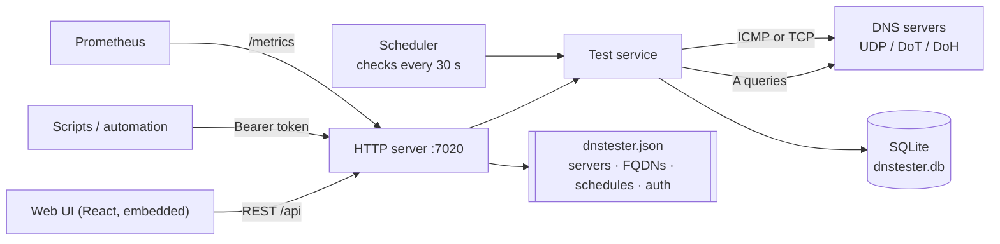

# go-dnstester

[](https://github.com/t0mer/go-dnstester/releases)
[](https://hub.docker.com/r/techblog/dnstester)
[](go.mod)
[](LICENSE)

A single Go binary that benchmarks DNS servers — plain UDP/53, DNS over TLS (DoT), and DNS over HTTPS (DoH) — by querying a configurable list of FQDNs, recording response times, pinging each server, and presenting the results in a modern web UI.

Use it to find the fastest resolver for your network, to compare public resolvers against your own (Pi-hole, AdGuard Home, router), or to track resolver latency over time with scheduled scans, a history view, trends, and Prometheus metrics. The web UI is embedded in the binary; results are stored in a local SQLite database.

## Table of Contents

- [Features](#features)
- [How It Works](#how-it-works)
- [Requirements](#requirements)
- [Getting Started](#getting-started)
- [Configuration](#configuration)
- [Default Configuration](#default-configuration)
- [Usage](#usage)
- [REST API](#rest-api)
- [Prometheus Metrics](#prometheus-metrics)
- [Security Notes](#security-notes)
- [Troubleshooting](#troubleshooting)
- [Development](#development)
- [Releases, Docker & CI](#releases-docker--ci)
- [Contributing](#contributing)
- [License](#license)

## Features

### Results Table
Query results in a sortable, filterable table: server name, protocol badge (DoT/DoH), FQDN, response time (ms), status, and resolved answers. Each query is an `A` record lookup with recursion desired; answers list the returned IPv4 addresses.


### Response Time Graph
Bar chart of average response time per server for the current run, with optional baseline overlay when comparing runs.


### Ping Results
ICMP latency (3 echo requests, average RTT) to each configured server. If an ICMP ping cannot be performed, it falls back to timing a TCP connect: port 53 for plain DNS, 853 for DoT, and the URL's port (default 443) for DoH. DoH servers are pinged by the hostname taken from their URL.


### Test History
Log of test runs from the last 24 hours with timestamp, query count, success rate, and average response time. Paginated with a configurable page size (10 / 25 / 50 / 100). Load any past run into the results view or set it as a baseline. Older runs remain in the database and are available through the API (`/api/history?hours=…` or `from`/`to`) and in Trends.


### Run Comparison
Select any two historical runs and see an overall delta, side-by-side bar chart, and a per-server breakdown with ms and percentage change.


### DNS Protocol Support
Test plain **UDP/53**, **DNS over TLS (DoT / port 853)**, and **DNS over HTTPS (DoH / RFC 8484)** side by side. Protocol is selectable per server when adding entries. Results carry a colored badge (blue = DoT, green = DoH) throughout the UI.

Pre-configured but disabled examples are included:

| Protocol | Servers |
|----------|---------|
| DoT | Cloudflare · Google · Quad9 |
| DoH | Cloudflare · Google · Quad9 · AdGuard |

### Scheduled Scans
Automatic runs on a flexible schedule: every N minutes/hours, daily, on specific weekdays, weekly, monthly, or once. Results are tagged and available in History and Compare. The scheduler checks for due schedules every 30 seconds.

### Settings
Manage DNS servers (with protocol), FQDNs, and scheduled scans. Back up, restore, export, and import the configuration. Authentication and general options (dark mode, auto-update) are also configured here.


<!-- TODO: screenshot — the Settings screenshot predates the protocol selector, General and Authentication sections -->

### Authentication

Optional authentication support — disabled by default, fully backward-compatible.

#### UI / Browser login
Enable **Require login** in Settings → Authentication to protect the web UI and API with a username and password (minimum 8 characters). On login, an HttpOnly session cookie (`SameSite=Strict`, 24-hour TTL) is issued. Passwords are stored as bcrypt hashes — never in plaintext. Changing the password signs out all sessions. Sessions are kept in memory, so restarting the server signs everyone out.

#### API token authentication
Enable **API token authentication** in Settings → Authentication and generate a token to require a Bearer token for all API access (including from the browser UI). Enabling the toggle alone does nothing until a token has been generated.

> **Important:** API token auth on its own does not protect the auth-management endpoints. With login turned off, anyone who can reach the port can generate a new token or turn token auth off. Only **Require login** gives real protection; use the token for scripts in addition to login, not instead of it.

- Click **Generate token** to create a 256-bit random token. **Copy it immediately — it is shown only once.** The server stores only a SHA-256 hash.
- Pass the token in every request:
  ```
  Authorization: Bearer <token>
  ```
- The browser UI stores the token in `localStorage` and sends it automatically — no friction after the first setup.
- Click **Revoke & disable** to immediately invalidate the token and turn off token enforcement.
- Click **Regenerate token** to rotate the active token.

Both modes can be combined: browser users log in with username/password; external scripts use the Bearer token.

<!-- TODO: screenshot — Authentication settings -->

### Dark Mode
Light/dark theme toggle (☀️ / 🌙) in Settings → General. The preference is saved to `localStorage` and respects the system `prefers-color-scheme` on first visit. Applied before first render — no flash.

### Mobile-First UI
Fully responsive layout that works on phones without horizontal scroll. The DNS results table adapts its columns, forms stack vertically, and the update modal slides up as a bottom sheet on small screens.

### Historical Trends
The **Trends** tab shows how DNS response times have changed over time with a time-series line chart — one line per server, auto-bucketed by day (7-day and 30-day views) or hour (24-hour view). Buckets are in UTC and only successful queries are counted. Includes a period-averages summary table with weighted mean and sample count per server. DoT and DoH servers appear alongside plain UDP so all three protocols can be compared over time.

Time range selector: **24 h** (hourly buckets) · **7 days** (daily) · **30 days** (daily).

<!-- TODO: screenshot — Trends tab -->

### Auto-Update
Optional automatic update checks (off by default, enable in Settings → General; a **Check for updates** button is also available there). When enabled, the UI checks the latest GitHub release every 4 hours. When a new release is detected:
- A modal shows the current vs latest version and the full rendered changelog.
- **Skip this version** — suppresses the modal for that release; a badge in the header remains as a reminder.
- **Remind me later** — hides the modal until the next check.
- **Update** — downloads the platform-specific binary, atomically replaces the running executable, and exits so the process manager (Docker `restart: unless-stopped`, systemd) restarts with the new version. The systemd unit installed by `service install` restarts after `RestartSec=120`, so expect about 2 minutes of downtime there. The page auto-reloads once the server is back.

Builds with version `dev` never report an update. Release binaries exist for Linux (amd64, arm64, armhf) and Windows (amd64) only, so there is no in-app update on other platforms. <!-- TODO: verify in-place replacement of a running .exe on Windows --> In Docker, prefer pulling a new image: an in-place update lives only in the container's writable layer and is lost when the container is recreated.

### Observability
Prometheus metrics at `/metrics` (latest run plus the last 5 runs) and an interactive Swagger UI at `/api/docs`. See [Prometheus Metrics](#prometheus-metrics) and [REST API](#rest-api).

## How It Works


```mermaid
flowchart LR
    UI["Web UI (React, embedded)"] -->|REST /api| API[HTTP server :7020]
    Scripts[Scripts / automation] -->|Bearer token| API
    Prom[Prometheus] -->|/metrics| API
    API --> Test[Test service]
    Sched[Scheduler<br/>checks every 30 s] --> Test
    Test -->|A queries| DNS["DNS servers<br/>UDP / DoT / DoH"]
    Test -->|ICMP or TCP| DNS
    Test --> DB[("SQLite<br/>dnstester.db")]
    API --> Cfg[["dnstester.json<br/>servers · FQDNs · schedules · auth"]]
```

- For each **enabled** server, every configured FQDN is queried concurrently (5-second timeout per query), and each server gets one ping probe (3 ICMP echoes, or a TCP connect fallback).
- Each completed run (manual or scheduled) is saved to `dnstester.db` in the config directory; History, Compare, Trends, and the per-run metrics read from it.
- Settings, schedules, and auth settings live in `dnstester.json` in the same directory. The file is written atomically and re-read on every request, so manual edits take effect without a restart.

## Requirements

- **Docker** (recommended), or a release binary for Linux (amd64 / arm64 / armhf) or Windows (amd64). Other platforms can build from source.
- Outbound network access to the DNS servers you test (UDP/53, TCP/853 for DoT, HTTPS for DoH).
- ICMP for ping results (optional — a TCP connect fallback is used when ICMP is unavailable).
- Internet access from the **browser** for the Swagger UI page (assets load from the unpkg CDN) and from the **server** for update checks (GitHub API).
- To build from source: Go 1.25+ and Node.js 20+.

## Getting Started

### Run with Docker (recommended)

```bash
docker run -d \
  --name dnstester \
  -p 7020:7020 \
  --cap-add NET_RAW \
  --restart unless-stopped \
  -v dnstester-config:/config \
  techblog/dnstester:latest
```

`--cap-add NET_RAW` is optional and harmless: ICMP uses unprivileged sockets, and `NET_RAW` is already in Docker's default capability set. Config and the SQLite database are persisted in the `dnstester-config` volume (`/config` inside the container).

Images are multi-arch: `linux/amd64`, `linux/arm64`, `linux/arm/v7`.

### Docker Compose

```yaml
services:
  dnstester:
    image: techblog/dnstester:latest
    container_name: dnstester
    ports:
      - "7020:7020"
    volumes:
      - dnstester-config:/config
    environment:
      - CONFIG_PATH=/config
    cap_add:
      - NET_RAW
    restart: unless-stopped

volumes:
  dnstester-config:
```

The same file ships as [`docker-compose.yaml`](docker-compose.yaml):

```bash
docker compose up -d
```

### Binary release

Download the binary for your platform from the [Releases](https://github.com/t0mer/go-dnstester/releases) page:

| Asset | Platform |
|-------|----------|
| `dnstester-<version>-linux-amd64` | Linux x86-64 |
| `dnstester-<version>-linux-arm64` / `-linux-aarch64` | Linux 64-bit ARM (identical builds) |
| `dnstester-<version>-linux-armhf` | Linux 32-bit ARMv7 (e.g. Raspberry Pi OS 32-bit) |
| `dnstester-<version>-windows-amd64.exe` | Windows x86-64 |

```bash
chmod +x dnstester-<version>-linux-amd64
./dnstester-<version>-linux-amd64 --port 7020
```

Open [http://localhost:7020](http://localhost:7020) in your browser.

### Run as a system service

The binary can install itself as a system service (systemd on Linux, the Service Control Manager on Windows) using [kardianos/service](https://github.com/kardianos/service). Run as root / Administrator:

```bash
sudo ./dnstester service install              # installs and starts on port 7020
sudo ./dnstester service install --port 8080  # custom port
sudo ./dnstester service uninstall            # stops and removes the service
```

On Linux, manage it with `systemctl status|stop|start|restart dnstester` and view logs with `journalctl -u dnstester -f`. On Windows use `sc query|stop|start dnstester` or the Services console.

Only `--port` is passed to the installed service; `--conf` is not. The service resolves its config directory from its own environment: `CONFIG_PATH`, then the OS default for the service user. If no user config directory can be determined, it falls back to `./dnstester` relative to the working directory, and the generated systemd unit sets no `WorkingDirectory`. To pin the location on Linux, set it in the environment file the unit already reads:

```bash
echo 'CONFIG_PATH=/var/lib/dnstester' | sudo tee /etc/sysconfig/dnstester
sudo systemctl restart dnstester
```

### Build from Source

**Prerequisites:** Go 1.25+ · Node.js 20+

```bash
make build-local
./dist/dnstester-<version>-linux-amd64
```

`make build-local` builds the UI, embeds it, and compiles a binary for the local OS/architecture into `dist/dnstester-<version>-<os>-<arch>`. `<version>` comes from `git describe`.

Open [http://localhost:7020](http://localhost:7020) in your browser.

## Configuration

### Command-Line Flags

| Flag | Default | Description |
|------|---------|-------------|
| `--port` | `7020` | Port for the web UI and API (listens on all interfaces, `0.0.0.0`) |
| `--conf` | *(see below)* | Path to the config directory |
| `service install [--port N]` | — | Install and start as a system service (subcommand, must be the first argument) |
| `service uninstall` | — | Stop and remove the system service |

Run `dnstester -h` for built-in help. There is no `--version` flag; the running version is shown by `GET /api/version` and in the UI.

### Environment Variables

| Variable | Default | Description |
|----------|---------|-------------|
| `CONFIG_PATH` | OS default (see below); `/config` in the Docker image | Config directory, used when `--conf` is not set |

### Config directory resolution (in order of precedence)

1. `--conf <path>` — CLI flag
2. `CONFIG_PATH` environment variable
3. OS default — `$XDG_CONFIG_HOME/dnstester` (or `~/.config/dnstester`) on Linux, `~/Library/Application Support/dnstester` on macOS, `%AppData%\dnstester` on Windows. If the OS default cannot be determined (e.g. `$HOME` is unset), `./dnstester` relative to the working directory is used.

The directory is created if it does not exist.

```bash
./dnstester --conf /etc/dnstester
CONFIG_PATH=/etc/dnstester ./dnstester
```

### Files in the config directory

| File | Purpose |
|------|---------|
| `dnstester.json` | Servers, FQDNs, schedules, auto-update, and auth settings. Created on the first save; built-in defaults are used until then. |
| `dnstester.backup.json` | Written by **Backup** / `POST /api/config/backup`, read by **Restore** |
| `dnstester.db` (+ `-wal`, `-shm`) | SQLite database with every test run. There is no automatic retention, so it grows over time. |

### `dnstester.json` keys

Normally managed from the Settings page or the API; shown here for reference and for editing by hand.

| Key | Type | Description |
|-----|------|-------------|
| `servers[]` | array | DNS servers to test |
| `servers[].name` | string | Display name |
| `servers[].address` | string | IP or `host[:port]` for UDP (port 53 by default) and DoT (port 853 by default); full `https://…` URL for DoH |
| `servers[].protocol` | string | `""` / `udp` (plain DNS), `dot`, or `doh` |
| `servers[].enabled` | bool | Only enabled servers are tested |
| `fqdns[]` | array of strings | Names queried (`A` records) against each server |
| `schedules[]` | array | Scheduled scans (see below) |
| `auto_update` | bool | Enable periodic update checks in the UI (default `false`) |
| `auth.enabled` | bool | Require username/password login |
| `auth.username` | string | Login username |
| `auth.password_hash` | string | bcrypt hash — set via Settings / `PUT /api/auth/settings` |
| `auth.api_token_enabled` | bool | Require a Bearer token for the API (only enforced once a token has been generated) |
| `auth.api_token_hash` | string | SHA-256 hash of the API token — set via `POST /api/auth/token` |

Schedule entries:

| Key | Used by | Description |
|-----|---------|-------------|
| `id` | all | Generated by the server |
| `name` | all | Required |
| `enabled` | all | Only enabled schedules run |
| `type` | all | `interval`, `daily`, `weekdays`, `weekly`, `monthly`, or `once` |
| `interval_minutes` | `interval` | Run every N minutes (> 0) |
| `time_of_day` | `daily`, `weekdays`, `weekly`, `monthly` | `HH:MM`, 24-hour, server local time |
| `weekdays` | `weekdays` | Days to run, `0` = Sunday … `6` = Saturday |
| `weekday` | `weekly` | Single day, `0` = Sunday … `6` = Saturday |
| `day_of_month` | `monthly` | `1`–`31` |
| `run_at` | `once` | RFC 3339 timestamp, e.g. `2026-10-01T08:00:00+03:00` |

## Default Configuration

### DNS Servers (UDP/53 — enabled by default)

| Name | Address |
|------|---------|
| Cloudflare | 1.1.1.1 |
| Cloudflare Alt | 1.0.0.1 |
| Google | 8.8.8.8 |
| Google Alt | 8.8.4.4 |
| Quad9 | 9.9.9.9 |
| OpenDNS | 208.67.222.222 |
| OpenDNS Alt | 208.67.220.220 |
| AdGuard | 94.140.14.14 |

### DNS Servers (DoT/DoH — disabled by default, enable to compare)

DoT addresses are stored without a port; `:853` is added at query time.

| Name | Protocol | Address |
|------|----------|---------|
| Cloudflare DoT | DoT | 1.1.1.1 |
| Google DoT | DoT | 8.8.8.8 |
| Quad9 DoT | DoT | 9.9.9.9 |
| Cloudflare DoH | DoH | https://cloudflare-dns.com/dns-query |
| Google DoH | DoH | https://dns.google/dns-query |
| Quad9 DoH | DoH | https://dns.quad9.net/dns-query |
| AdGuard DoH | DoH | https://dns.adguard-dns.com/dns-query |

### FQDNs queried by default

`google.com` · `cloudflare.com` · `github.com` · `microsoft.com` · `apple.com`

All servers and FQDNs are fully configurable from the Settings page or the API.

## Usage

### Web UI

The UI has five tabs (the active tab is kept in the URL hash, e.g. `#history`):

1. **Results** — click **Run Test** to query every enabled server. Shows the response-time graph, the results table, and ping results for the latest run. The latest result survives restarts (it is loaded from the database).
2. **Compare** — pick two runs to see overall and per-server deltas.
3. **History** — runs from the last 24 hours; load one into Results or set it as a baseline for the graph.
4. **Trends** — response-time lines per server over 24 h / 7 days / 30 days.
5. **Settings** — servers and FQDNs, backup/restore/export/import, scheduled scans, General (dark mode, auto-update), and Authentication.

### Scripting with the API

```bash
# Run a test and get the full result as JSON
curl -s -X POST http://localhost:7020/api/test/run

# With API token authentication enabled
curl -s -X POST -H "Authorization: Bearer $DNSTESTER_TOKEN" http://localhost:7020/api/test/run

# Runs from the last 7 days
curl -s "http://localhost:7020/api/history?hours=168&limit=100"

# Add a schedule that runs every 30 minutes
curl -s -X POST http://localhost:7020/api/schedules \
  -H 'Content-Type: application/json' \
  -d '{"name":"Every 30 min","enabled":true,"type":"interval","interval_minutes":30}'
```

A test run is synchronous: the request returns when all queries and pings have finished (each has a 5-second timeout).

## REST API

Interactive Swagger UI at `/api/docs` · OpenAPI spec at `/api/openapi.json`.

When API token authentication is enabled, click the **Authorize** button in Swagger UI and enter your Bearer token. The token persists across page reloads (`persistAuthorization: true`).

Unless marked otherwise, every endpoint requires authentication once login is enabled, or once API token auth is enabled **and** a token has been generated (a session cookie or a valid Bearer token is accepted). Enabling token auth without generating a token leaves the API open. With authentication disabled (the default), the API is open.

### Authentication

| Method | Endpoint | Auth required | Description |
|--------|----------|---------------|-------------|
| `GET` | `/api/auth/status` | No | Returns auth configuration and whether the request is authenticated |
| `POST` | `/api/auth/login` | No | Log in with `{"username","password"}`; sets a session cookie |
| `POST` | `/api/auth/logout` | No | Clears the session cookie |
| `PUT` | `/api/auth/settings` | Session (when login is enabled) | Enable/disable login or token auth; set username and password |
| `POST` | `/api/auth/token` | Session (when login is enabled) | Generate a new API token (returned once in plaintext) |
| `DELETE` | `/api/auth/token` | Session (when login is enabled) | Revoke the token and disable API token auth |

### Tests

| Method | Endpoint | Description |
|--------|----------|-------------|
| `GET` | `/api/test/run` | Run a DNS test, save it, and return the results |
| `POST` | `/api/test/run` | Same as GET |
| `GET` | `/api/test/latest` | Return the most recent test results (404 if none) |

### History

| Method | Endpoint | Description |
|--------|----------|-------------|
| `GET` | `/api/history?limit=25&offset=0` | Paginated list of runs — returns `{ total, items }` |
| `GET` | `/api/history/{id}` | Get a specific historical run |
| `GET` | `/api/compare?a={id}&b={id}` | Compare two runs |

`/api/history` query parameters: `limit` (default 100, max 500), `offset`, `hours` (look-back window, default 24), `from` / `to` (RFC 3339, override `hours`), `scheduled=true` (scheduled runs only).

### Trends

| Method | Endpoint | Description |
|--------|----------|-------------|
| `GET` | `/api/trends?hours=168` | Per-server avg response time bucketed by day (default 7 days) or hour (≤48 h); `hours` max 8760 |

### Configuration

| Method | Endpoint | Description |
|--------|----------|-------------|
| `GET` | `/api/settings` | Get current configuration (password and token hashes are stripped) |
| `PUT` | `/api/settings` | Replace current configuration (the `auth` section is ignored — use `/api/auth/*`). Only this endpoint (and its `/api/config` alias) preserves auth; restore and import replace it |
| `POST` | `/api/config/backup` | Create a config backup |
| `POST` | `/api/config/restore` | Restore config from backup |
| `GET` | `/api/config/export` | Download config as JSON |
| `POST` | `/api/config/import` | Import config from JSON (max 1 MiB); replaces the whole file, including the `auth` section |

> `/api/config` (GET/PUT) are backward-compatible aliases for `/api/settings`.

### Schedules

| Method | Endpoint | Description |
|--------|----------|-------------|
| `GET` | `/api/schedules` | List scheduled scans |
| `POST` | `/api/schedules` | Create a scheduled scan |
| `PUT` | `/api/schedules/{id}` | Update a scheduled scan |
| `DELETE` | `/api/schedules/{id}` | Delete a scheduled scan |

See [schedule entries](#dnstesterjson-keys) for the request body fields.

### Version & Updates

| Method | Endpoint | Description |
|--------|----------|-------------|
| `GET` | `/api/version` | Current binary version |
| `GET` | `/api/update/check` | Check GitHub for a newer release |
| `POST` | `/api/update/apply` | Download the binary from the URL given in `{"download_url": "…"}` (the UI sends the GitHub release asset URL), replace the running executable, and restart |

### Observability & Docs (no authentication)

| Method | Endpoint | Description |
|--------|----------|-------------|
| `GET` | `/metrics` | Prometheus metrics (response times, last 5 run results) |
| `GET` | `/api/docs` | Swagger UI |
| `GET` | `/api/openapi.json` | OpenAPI 3.0 spec |

## Prometheus Metrics

`/metrics` exposes the standard Go/process collectors plus the following gauges (all times in seconds):

| Metric | Labels | Description |
|--------|--------|-------------|
| `dnstester_dns_response_seconds` | `server_name`, `server_addr`, `fqdn`, `status` | DNS response time from the latest run in this process |
| `dnstester_ping_latency_seconds` | `server_name`, `server_addr`, `status` | Ping latency from the latest run in this process |
| `dnstester_last_run_timestamp_seconds` | — | Unix start time of the latest run |
| `dnstester_last_run_duration_seconds` | — | Duration of the latest run |
| `dnstester_test_runs_total` | — | Number of runs stored in the database |
| `dnstester_run_info` | `run_id`, `started_at`, `status` | Always `1`; one series per run for the last 5 runs |
| `dnstester_run_duration_seconds` | `run_id` | Duration of each of the last 5 runs |
| `dnstester_run_dns_response_seconds` | `run_id`, `server_name`, `server_addr`, `fqdn`, `status` | DNS response time per run (last 5 runs) |
| `dnstester_run_ping_latency_seconds` | `run_id`, `server_name`, `server_addr`, `status` | Ping latency per run (last 5 runs) |

For DNS metrics `status` is `ok` or `error` (timeouts count as `error`); for ping metrics it is `ok`, `error`, or `timeout`. On `dnstester_run_info`, `status` is the run status (e.g. `completed`). The latest-run metrics are empty after a restart until a test runs. Tests only run when triggered, so add a [scheduled scan](#scheduled-scans) to keep the metrics fresh.

Example scrape config:

```yaml
scrape_configs:
  - job_name: dnstester
    static_configs:
      - targets: ["dnstester:7020"]
```

## Security Notes

- **Authentication is off by default.** Anyone who can reach the port can run tests, change settings and schedules, and trigger the self-update endpoint. Keep the service on a trusted network, or enable **Require login** before exposing it, ideally behind a TLS reverse proxy.
- **API token auth alone is not enough.** With login off, the auth-management endpoints are unprotected, so anyone who can reach the port can issue a new token or disable token auth. Only **Require login** protects them.
- The server speaks plain HTTP. The session cookie is not marked `Secure`, so use HTTPS via a reverse proxy when logging in over untrusted networks.
- `/metrics`, `/api/docs`, and `/api/openapi.json` are always unauthenticated.
- Passwords are stored as bcrypt hashes and the API token as a SHA-256 hash in `dnstester.json`. `GET /api/settings` strips them, but **Export**, **Restore**, and **Import** return the hashes in their responses — treat exported files and the config volume as sensitive. Restore and Import replace the `auth` section wholesale, so anyone with API access (including a Bearer-token holder) can change the login credentials this way.
- DoT queries do not verify the server's TLS certificate (servers are often addressed by IP). The tool measures latency; it does not validate resolver identity.
- `POST /api/update/apply` downloads the binary from whatever URL the request supplies. The URL is not restricted to GitHub or HTTPS, and the download is not checked (no checksum or signature). Anyone who can call this endpoint can make the server download and run arbitrary code, which is one more reason to enable **Require login**.

## Troubleshooting

- **Ping shows `unreachable`.** ICMP could not be used and the TCP connect fallback to the server's DNS port also failed. When ICMP is unavailable but TCP works, the ping column shows the TCP connect time instead. The app uses unprivileged ICMP sockets; on Linux these are allowed by `net.ipv4.ping_group_range` (Docker's default permits them).
- **Ping shows `timeout`.** ICMP echoes were sent but no replies came back (e.g. the server or a firewall drops ICMP). The TCP fallback is not tried in this case.
- **Scheduled scans run at the wrong hour.** `time_of_day` uses the server's local time zone. The Docker image does not include time-zone data, so containers use UTC unless you mount the host's zone file, e.g. `-v /etc/localtime:/etc/localtime:ro`. Setting `TZ` alone does not work, because the image has no zone database.
- **The History tab is missing older runs.** It shows the last 24 hours. Use Trends or `/api/history?hours=…` for older data.
- **`/api/docs` is blank.** Swagger UI assets load from `unpkg.com`; the browser needs internet access.
- **Locked out after enabling login.** Set `"enabled": false` (and `"api_token_enabled": false`) under `auth` in `dnstester.json`. The file is re-read on every request, so no restart is needed.
- **`go build` fails with `pattern dist: no matching files found`.** The UI has not been built yet. Use `make build-local` (or build the UI and copy `web/ui/dist` to `web/dist`).

## Development

### Build Commands

```bash
make build             # Cross-compile production binaries (all release targets)
make build-dev         # Same targets, dev build mode
make build-local       # Build for local architecture only (fastest)
make test              # go test ./...
make lint              # go vet ./...
make clean             # Remove dist/ and web/dist/*, then write a placeholder web/dist/index.html
                       # (fails on a fresh clone where web/dist does not exist yet)
make next-version      # Print the next CalVer version
```

`scripts/build.sh` builds the UI (`npm ci && npm run build` in `web/ui`), copies it to `web/dist` (embedded with `go:embed`), and cross-compiles with `CGO_ENABLED=0` into `dist/`. The `TARGETS` environment variable overrides the target list. `make test` and `make lint` also need `web/dist`, so run a build first.

UI dev server (proxies `/api` to the Go server on `:7020`):

```bash
cd web/ui && npm run dev
```

### Project Layout

```
cmd/dnstester/       main entry point, flags, service install/uninstall
internal/auth/       sessions, password hashing, API tokens, auth middleware
internal/config/     dnstester.json load/save, defaults, backup/restore
internal/handler/    HTTP handlers, embedded OpenAPI spec and Swagger UI
internal/metrics/    Prometheus collector
internal/model/      shared data types
internal/server/     HTTP routing and SPA serving
internal/service/    DNS (UDP/DoT/DoH), ping, test runner, scheduler, self-update
internal/store/      SQLite storage, history, compare, trends
web/ui/              React + TypeScript + Vite + Tailwind frontend
web/embed.go         embeds web/dist into the binary
scripts/             build.sh, next-version.sh
```

Tech stack: Go 1.25, [miekg/dns](https://github.com/miekg/dns), [pro-bing](https://github.com/prometheus-community/pro-bing), [modernc.org/sqlite](https://pkg.go.dev/modernc.org/sqlite) (CGO-free), [prometheus/client_golang](https://github.com/prometheus/client_golang), [kardianos/service](https://github.com/kardianos/service); React 18, TanStack Query, Recharts, Tailwind CSS.

## Releases, Docker & CI

Multi-platform Docker images are published to [Docker Hub](https://hub.docker.com/r/techblog/dnstester) after every GitHub release:

```
techblog/dnstester:latest
techblog/dnstester:<version>          # e.g. 2026.5.7
```

Supported platforms: `linux/amd64` · `linux/arm64` · `linux/arm/v7` (armhf)

Releases follow **CalVer** (`YYYY.M.PATCH`) and are triggered manually via the GitHub Actions `Release` workflow, which tags the commit, builds all targets, and attaches the binaries to a GitHub Release. The `Docker Build` workflow runs automatically after each successful release.

## Contributing

Issues and pull requests are welcome. Please run `make test` and `make lint` before opening a PR, and keep the OpenAPI spec (`internal/handler/openapi.go`) and this README in sync with API changes.

## License

Licensed under the [Apache License 2.0](LICENSE).
